# Overview

Introduction to basics of full stack development. 

## Points of interest

- [AJAX](https://fullstackopen.com/en/part0/fundamentals_of_web_apps#ajax) (Asynchronous JavaScript and XML), released in February 2005, was a step forward in web development, allowing allowing content to be fetched using JS within the HTML. It is now outdated.
- [SPA](https://fullstackopen.com/en/part0/fundamentals_of_web_apps#single-page-app) (Single Page App) dynamically re-writes the content in the browser without requesting more content from the server. Informed a lot of JavaScript frameworks.

### Frameworks / Libraries

- Out of date frameworks include: jQuery, BackboneJS
- More modern implementations include:
    - AngularJS (Google, 2012)
    - Angular2 (Google, 2014, not backwards compatible.)
    - React (Facebook, 2013)
    - Redux (Dan Abramov and Andrew Clark, 2015)
    - VueJS (Evan You, 2014)

## Assigned readings

0.1 [HTML: Creating the content](https://developer.mozilla.org/en-US/docs/Learn_web_development/Getting_started/Your_first_website/Creating_the_content)

0.2 [CSS: styling the content](https://developer.mozilla.org/en-US/docs/Learn_web_development/Getting_started/Your_first_website/Styling_the_content)

0.3 [Your first form](https://developer.mozilla.org/en-US/docs/Learn_web_development/Extensions/Forms/Your_first_form)

## Exercises

0.4 New note diagram using Mermaid syntax

```mermaid
sequenceDiagram
    participant browser
    participant server

    Note right of browser: The browser sends the user input to the server as a payload which updates the list of notse on the server

    browser->>server: POST https://studies.cs.helsinki.fi/exampleapp/new_note
    activate server
    server-->>browser: 302 HTML redirect
    deactivate server

    Note left of server: The response from the server triggers the browser to make GET requets for the /notes page

    browser->>server: GET https://studies.cs.helsinki.fi/exampleapp/notes
    activate server
    server-->>browser: HTML document
    deactivate server

    browser->>server: GET https://studies.cs.helsinki.fi/exampleapp/main.css
    activate server
    server-->>browser: the css file
    deactivate server

    browser->>server: GET https://studies.cs.helsinki.fi/exampleapp/main.js
    activate server
    server-->>browser: the JavaScript file
    deactivate server

    Note right of browser: The browser starts executing the JavaScript code that fetches the JSON from the server

    browser->>server: GET https://studies.cs.helsinki.fi/exampleapp/data.json
    activate server
    server-->>browser: [{ "content": "HTML is easy", "date": "2023-1-1" }, ... ]
    deactivate server

    Note right of browser: The browser executes the callback function that renders the notes
```

0.5 Single page app diagram

0.6 New note in single page app diagram 

